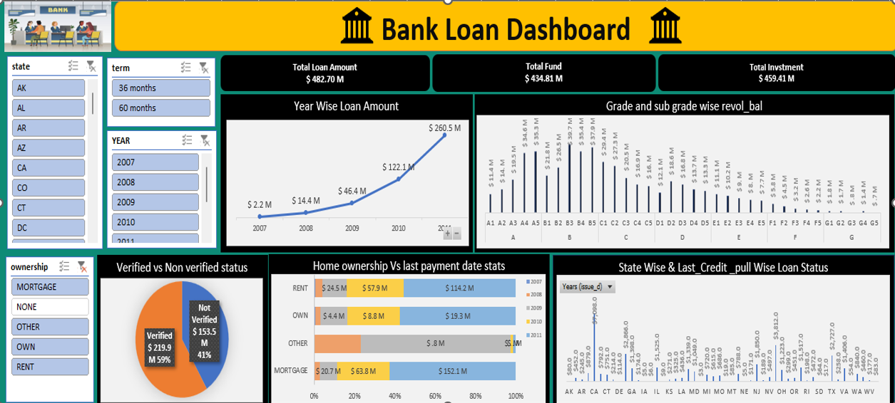
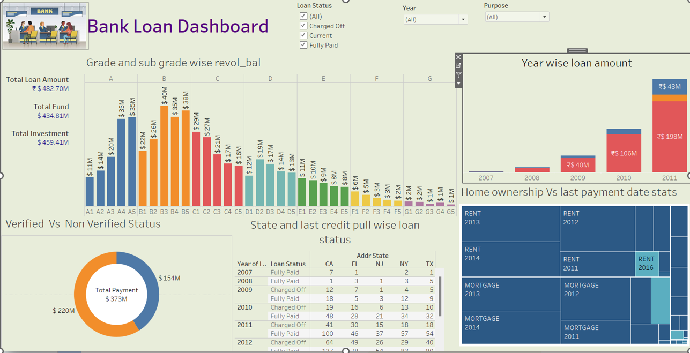

# 🏦 Bank Loan Data Analysis Project

## 📊 Overview
This project focuses on analyzing bank loan data to understand borrower behavior, loan performance, and risk patterns. The dataset includes loan details, borrower information, loan grades, and payment status.

The analysis was performed using SQL, Excel, Power BI, and Tableau to generate actionable business insights.

---

## 🎯 Objectives
- Analyze loan performance and repayment trends  
- Identify high-risk borrowers using loan grades  
- Understand the impact of verification status on loan outcomes  
- Study geographical loan distribution  
- Perform customer behavior analysis  

---

## 🛠️ Tools Used
- Microsoft Excel  
- SQL (Aggregation, Group By, Joins)  
- Power BI  
- Tableau  

---

## 📁 Dataset Description
The dataset includes:
- Loan Amount, Interest Rate, Installments  
- Loan Grade & Sub-grade  
- Borrower Details (State, ZIP Code, Verification Status)  
- Loan Purpose (Debt Consolidation, Credit Card, etc.)  
- Loan Status (Fully Paid, Current, etc.)  
- Issue Date (Time-based analysis)  

---

## 📈 Key Analysis Performed

### 🔹 SQL Analysis
- Year-wise loan amount analysis  
- Grade & sub-grade based revolving balance  
- Payment trends by verification status  
- Data aggregation and grouping for insights  

---

## 📷 Dashboard Preview

### 📊 Excel Dashboard

### 📊 Power BI Dashboard

### 📊 Tableau Dashboard

---

## 📊 Key Insights

- Debt consolidation is the most common loan purpose  
- Higher-risk loan grades have higher interest rates  
- Verified loans show better repayment performance  
- Fully paid loans dominate, indicating strong repayment behavior  
- States like California and New York show higher loan activity  

---

## 📌 Conclusion
The analysis highlights how borrower behavior, verification status, and loan grading impact loan performance. It also emphasizes the importance of data-driven decision-making in managing financial risk.

---

## 🚀 Business Recommendations

- Improve borrower verification to reduce default risk  
- Apply stricter policies for high-risk loan grades  
- Expand lending in underutilized regions  
- Promote debt consolidation loan products  
- Offer flexible loan terms to improve customer satisfaction  

---

## 📁 Project Structure

